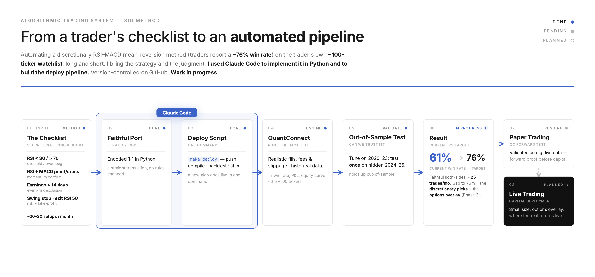

# trader — SID Method × QuantConnect

Automating a hand-traded discretionary swing-trading method (the **"SID Method,"**
an RSI/MACD mean-reversion strategy reported at a **~76% win rate**) into a tested,
**survivorship-free-validated**, one-command-deployable **QuantConnect** pipeline.

The goal isn't to invent a strategy — it's to **faithfully reproduce a working
discretionary method in code, validate it honestly, and run it forward without a
human in the loop.**

**I bring the strategy and the judgment; I use Claude Code as the implementation
and automation engine** — it coded the method in Python and built the one-command
deploy. Stack: **Python · QuantConnect/LEAN · GitHub · Claude Code**.



> 📄 **One-page results summary:** [`docs/onepager/sid_onepager.pdf`](docs/onepager/sid_onepager.pdf)
> · **pipeline diagram:** [PDF](docs/pipeline/sid_method_pipeline.pdf)

**How I use Claude Code:**
- **Implementation** — I supply the trading method and the judgment calls (what to
  test, how to read it); Claude codes it in Python — the faithful port and every
  backtested variant.
- **Automation** — I had Claude build a **one-command deploy** (`make deploy` →
  push · compile · backtest · ship), plus the CI test suite.

**Status: work in progress** — shares pipeline validated; forward paper-trade and
the options overlay are next.

## Results

QuantConnect/LEAN, 2020-01-01 → 2026-04-30, realistic IBKR fill model.

**Deployable config** — long-only, survivorship-free universe, ATR-trailing exit:

| Net return | CAGR | Max drawdown | Sharpe | 2022 (bear) |
|---|---|---|---|---|
| **+70.5%** | 8.8% | 12.4% | 0.30 | **+4.5%** vs SPY −18% |

**Key finding — the short side has no edge.** Running the *identical* method on
both sides drops it from **+70.5% to −16.0%** (max drawdown 40%): shorting
overbought equities has negative expectancy, matching the mean-reversion
literature. So long-only is a **finding, not a filter**.

**Faithful run** (both sides, his RSI-50 exit) → **~61% win rate at ~25
trades/month**, cadence matching his hand-trading. The gap to his reported **~76%**
is discretion (one daily "top pick," chart reads, early exits), not a coding error
— the engine reproduces his real trades.

## The method

A daily-chart mean-reversion system, ported 1:1 from the published checklist:

- **Entry:** RSI(14) < 30 (oversold → long) or > 70 (overbought → short)
- **Confirmation:** RSI and MACD(12,26,9) align (point/cross) in the trade direction
- **Earnings filter:** no entry within 14 days of earnings
- **Stop:** swing low/high between signal and entry, rounded to the whole dollar
- **Exit:** take profit when RSI returns to 50 (only two exits: stop or RSI-50)

Cadence in his hands: **~20–30 setups/month**, entered in the last hour, ~5–7
trading days per trade. Modeled with **QuantConnect's Interactive Brokers fill
model** and **split-adjusted** data; cross-checked against his own logged trades
(reproduces his DIS example to the day).

## Universe & honest validation

We trade **only the ~100 tickers he actually trades** — his watchlist is "about
50-50 stocks/ETFs"; we compiled a deduped **92-ticker** list from his published
"Stocks List of Profitable Trades" slides (large/liquid names + sector/index ETFs +
leveraged/inverse ETFs like TQQQ/TZA/NUGT that mean-revert strongly).

Committing in advance to one universe removes per-period cherry-picking — but his
list was *chosen with hindsight* on past winners. So the honest proof is two
things the headline numbers above already reflect:

1. **A survivorship-free universe** rebuilt from point-in-time ETF holdings —
   measures how much edge is *the method* vs *the names*. (This is the equity
   curve in the one-pager.)
2. **A forward paper test** — the real out-of-sample gate (Phase 1's final step).

## The algorithm (`sid_method.py`)

`sid_method.py` is **one parameterized algorithm** that drives every test from a
single compile — so each A/B is clean (no code drift) and a train/test holdout is
just a parameter change.

| Param | Values | Purpose |
|---|---|---|
| `universe` | `dynamic` · `watchlist` · `etf_rule` | broad stress test · author's list · **survivorship-free ETF-holdings rule** |
| `exit_mode` | `rsi50` · `trail` | author's RSI-50 take-profit · ATR trailing stop |
| `side` | `both` · `long` · `short` | isolate the long edge / drop toxic shorts |
| `spy_filter`, `weekly_filter`, `earnings_exit`, `max_days` | on/off | ablate add-ons **not** in the published method |
| `tickers`, `start_*` / `end_*` | override | single-name + tight-window trade validation |

- **Faithful, checklist-only run:** `spy_filter=0 weekly_filter=0 max_days=0 earnings_exit=0`.
- **Holdout:** train `2020-01-01…2023-12-31`, test `2024-01-01…2026-04-30` — judge by
  expectancy / profit-loss ratio, not win rate.

Reproduce: create a QuantConnect Python project, paste `sid_method.py` as
`main.py`, and run with the parameter sets above — or use the deploy command below.

## Deploy (one command)

`deploy.py` ships a strategy to QuantConnect end-to-end — push → compile →
backtest → print stats — so a new algo goes live in one command:

```
make deploy STRATEGY=sid_method.py
# or with parameters:
python3 deploy.py sid_method.py --params universe=watchlist side=long start_year=2024
```

Credentials come from the environment or a (gitignored) `.env` (QuantConnect →
Account → Security): `QC_USER_ID`, `QC_API_TOKEN`. Add `--no-backtest` to deploy +
compile only.

## Tests

The deterministic strategy math is unit-tested (`tests/`, 26 tests, run in CI via
[`.github/workflows/tests.yml`](.github/workflows/tests.yml)):

- `test_indicators.py` — RSI / MACD / SMA: invariants (RSI bounded [0,100],
  all-gains→100, warmup NaN, histogram ≡ line − signal) plus characterization
  locks on a fixed price vector, so a formula change trips a test.
- `test_earnings.py` — the pure earnings-date helpers (the > 14-day rule).

```
pip install -r requirements-dev.txt
python3 -m pytest tests/ -q
```

The *deterministic math* is unit-tested; the *strategy behavior* is validated
empirically on QuantConnect against the author's own logged trades.

## Roadmap

- **Phase 1 — Shares pipeline** *(nearly done):* faithful signal, survivorship-free
  validation, trade cross-checks; deployable config locked (long-only, ATR-trailing,
  1% risk). Final gate: **forward paper-trade on QuantConnect.**
- **Phase 2 — Options overlay** *(planned):* express each signal the way he does —
  ≈2 months out, ATM or 1-strike OTM, calls (bullish) / sold puts (income); model
  option chains, premiums, assignment. *(His real returns come from this overlay,
  which a shares backtest can't capture.)*
- **Phase 3 — Live** *(planned):* promote only after a forward edge holds; small size.

## Repo layout

```
trader/
├── sid_method.py    # the QuantConnect/LEAN algorithm — one compile drives every variant
├── deploy.py        # one-command push → compile → backtest → stats
├── shared/          # the indicator/earnings/config math the tests lock down
├── tests/           # unit tests for that math (CI)
└── docs/            # one-pager (results) + pipeline graphic
```

> **A note on scope.** This repo is the **QuantConnect** pipeline — the faithful
> port, the survivorship-free validation, and the one-command deploy. The
> **local** track — a daily EOD scanner with email alerts and **IBKR** paper
> execution, plus two other research strategies — lives in a separate repo,
> [`ibkr-trader`](https://github.com/sydneywatk/ibkr-trader). IBKR is **not**
> part of this pipeline; QuantConnect handles execution natively.

## Setup

```
cp .env.example .env          # add QC_USER_ID / QC_API_TOKEN for deploy
pip install -r requirements.txt
```

QuantConnect work runs in the QC cloud (MCP server / web IDE) — no local market
data needed.

## Conventions

- Shared modules use `from shared.X import ...`; QuantConnect code is self-contained
  and PEP8 (snake_case) per the QC LEAN API.
- The QuantConnect algorithm inlines its constants (it runs in the QC cloud, which
  can't import the local package); `shared/` exists as the reference math the unit
  tests lock down, mirroring the port.
